# 🎓 Online Courses Platform

[](https://dotnet.microsoft.com/download/dotnet/8.0)
[](https://vuejs.org/)
[](https://www.postgresql.org/)
[](https://www.docker.com/)

A modern, full-stack online courses management platform built with **Clean Architecture**, **.NET 8**, **PostgreSQL**, and **Vue.js 3**.

---

## 🏗️ Architecture

## 🏗️ Arquitectura del Sistema

El proyecto sigue los principios de **Clean Architecture**, dividiendo la lógica en capas para asegurar el desacoplamiento y la facilidad de prueba.

```mermaid
graph TD
    subgraph "Capa de Presentación (API)"
        API[OnlineCourses.Api]
        Swagger[Swagger/OpenAPI v1]
    end
    
    subgraph "Capa de Aplicación"
        Services[Servicios de Aplicación]
        DTOs[Data Transfer Objects]
        Interfaces[Interfaces de Servicios]
    end
    
    subgraph "Capa de Dominio"
        Entities[Entidades de Dominio]
        Enums[Enumeraciones]
        DomainInterfaces[Interfaces de Repositorio / Unit of Work]
    end
    
    subgraph "Capa de Infraestructura"
        DBContext[AppDbContext - PostgreSQL]
        Repos[Implementación de Repositorios]
        Identity[ASP.NET Core Identity]
        UoW[Unit of Work]
    end

    API --> Services
    Services --> DomainInterfaces
    Repos --> DomainInterfaces
    UoW --> DomainInterfaces
    DBContext --> Entities
```



### Patrones Utilizados
- **Repository Pattern**: Abstracción del acceso a datos.
- **Unit of Work**: Gestión de transacciones y atomicidad de operaciones.
- **Dependency Injection**: Inversión de control para desacoplamiento.
- **JWT & Refresh Tokens**: Seguridad avanzada para autenticación.

---

## 🛠️ Solución de Problemas (Troubleshooting)

### Error 500 en Login (Conectividad DB)
Si experimentas un error 500 al intentar loguearte, generalmente se debe a que el backend no puede alcanzar la base de datos.
1. Verifica que el contenedor de la base de datos esté corriendo: `docker ps`.
2. Asegúrate de que los puertos no estén en conflicto.
3. Si usas el despliegue manual, verifica que el backend use el nombre del contenedor de la DB (`onlinecourses_db_manual`) en su cadena de conexión.

### Problemas con Docker (Permisos/Zombies)
Si Docker muestra errores de "permission denied" o contenedores que no se detienen:
1. Reinicia el servicio de Docker: `sudo systemctl restart docker`.
2. Limpia recursos huérfanos: `docker system prune -f`.
3. Si persiste, un reinicio de la máquina host suele ser la solución definitiva.

---

## 🧪 Pruebas (Testing)

El proyecto cuenta con una suite de **más de 10 tests unitarios** que cubren las reglas de negocio críticas.

Para ejecutar los tests:
```bash
cd backend/OnlineCourses.UnitTests
dotnet test
```

También se incluye una **Colección de Postman** en la raíz del proyecto: `OnlineCourses_Postman_Collection.json`.

---

## ✨ Key Features

- **🔐 Authentication & Security**:
  - JWT-based authentication.
  - Secure Login and User Registration.
  - User profile display and Logout functionality.
- **📚 Course Management**:
  - Full CRUD operations for courses.
  - Publish/Unpublish workflow with business rule validation.
  - Soft delete pattern for data safety.
- **📖 Lesson Management**:
  - Add and manage lessons within courses.
  - Automatic lesson ordering validation.
- **🐳 Docker Orchestration**:
  - Fully containerized environment for Database, Backend, and Frontend.
- **🧪 Quality Assurance**:
  - Comprehensive unit tests for business rules and domain logic.

---

## 🚀 Quick Start (Docker)

The easiest way to run the platform is using Docker Compose.

1. **Clone the repository** and navigate to the root directory.
2. **Start the services**:
   ```bash
   docker-compose up --build
   ```
3. **Access the application**:
   - **Frontend**: [http://localhost:3000](http://localhost:3000)
   - **Backend API (Swagger)**: [http://localhost:8080/swagger](http://localhost:8080/swagger)

### 🔑 Default Credentials
The system automatically seeds an administrator account:
- **Email**: `admin@example.com`
- **Password**: `AdminPassword123!`

---

## 🛠️ Manual Setup (Development)

### Backend (.NET 8)
1. Navigate to `backend/`.
2. Configure your PostgreSQL connection in `appsettings.json` or via environment variables.
3. Run migrations:
   ```bash
   dotnet ef database update --project OnlineCourses.Infrastructure --startup-project OnlineCourses.Api
   ```
4. Start the API:
   ```bash
   dotnet run --project OnlineCourses.Api
   ```

### Frontend (Vue.js 3)
1. Navigate to `frontend/`.
2. Install dependencies:
   ```bash
   npm install
   ```
3. Start the development server:
   ```bash
   npm run dev
   ```

---

## 🧪 Testing

Run the backend unit tests to verify business rules:

```bash
cd backend
dotnet test
```

Tests include validation for:
- Course publishing requirements (must have lessons).
- Lesson ordering uniqueness.
- Soft delete functionality.

---

## 📂 Project Structure

```text
├── backend/
│   ├── OnlineCourses.Domain/         # Core Entities & Logic
│   ├── OnlineCourses.Application/    # Business Services & DTOs
│   ├── OnlineCourses.Infrastructure/ # Data Access & Identity
│   ├── OnlineCourses.Api/            # Controllers & Configuration
│   └── OnlineCourses.UnitTests/      # xUnit Test Suite
├── frontend/
│   ├── src/
│   │   ├── views/                    # Pages (Login, Register, Courses)
│   │   ├── services/                 # API Client (Axios)
│   │   └── router/                   # Vue Router Config
│   └── public/                       # Static Assets
└── docker-compose.yml                # Orchestration Config
```
